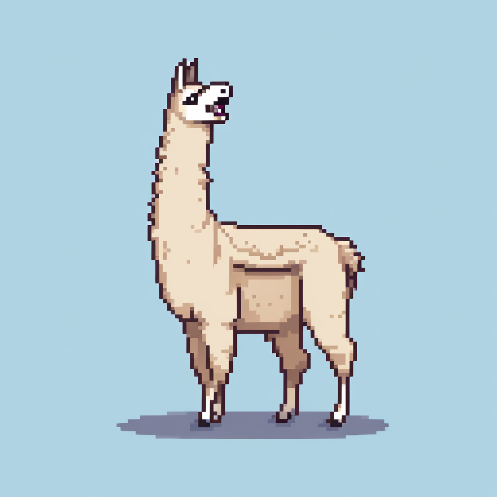

Imagine Llama yawaning

_created with [fal.ai](https://fal.ai/)_

##### The Scared Llama appeares 

 Default [notion](https://notion.so) urls have a very interesting naming convention. They use two unrealated words, randomly I guess, and somehow it makes perfect sense. That's what happened when I published a page back in November. That's how the Scared Llama appeared.

##### Other randomest names that I could find as notion urls
- enormous-terrier
- (will upadate this list as I recall)

That's all for now, I'm sure I'll try to write more interesting things in the future.

___Using MDX to write this, still trying to get the hang of the formating___ 